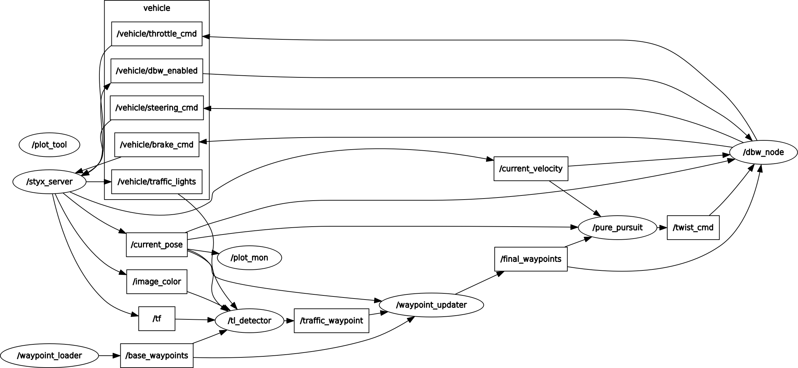
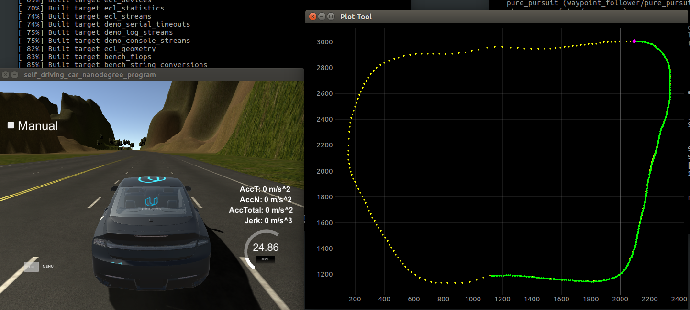
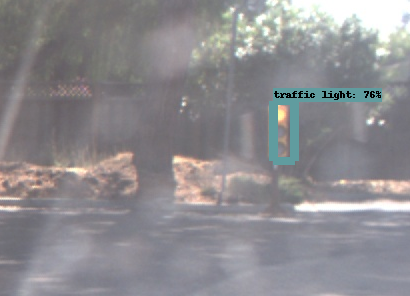
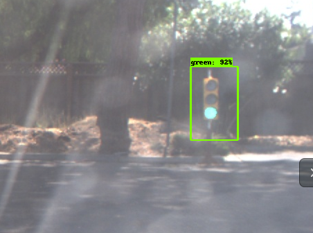

This is the project repo for the final project of the Udacity Self-Driving Car Nanodegree: Programming a Real Self-Driving Car using ROS. More information can be found from project introduction page [here](https://classroom.udacity.com/nanodegrees/nd013/parts/6047fe34-d93c-4f50-8336-b70ef10cb4b2/modules/e1a23b06-329a-4684-a717-ad476f0d8dff/lessons/462c933d-9f24-42d3-8bdc-a08a5fc866e4/concepts/5ab4b122-83e6-436d-850f-9f4d26627fd9).

## System introduction

### Diagram

The final project diagram is illustrated below. It consists of four major components: perception, planning, control/execution and environment(Udacity Car Simulator). The whole system operates on ROS and there are several ROS nodes in each of the first three components. 


In my team, [Zoom_Ahead](https://github.com/girishpai/CarND_Zoom_Ahead), my main contributions are:
* (Part of ) /tl_detector node: A neural-network based traffic light state classifier (in Traffic Light Detection Node). 
* /plot_mon node : A visualization tool subscribing to /current_pose message and tracks vehicle actual waypoints against /base_waypoints live.

All other nodes code are copied from team github repo.




### Waypoint following visualization 

Just looking at the simulator window, it is very hard to tell how well/bad our control algorithms are doing. I tried Rviz and found it is very heavy-lifting and relies on some transformation matrix definition first of all. Finally I integrated the tool from [2D_Plot_Tool](https://github.com/clearpathrobotics/2D_Plot_Tool) to our project as a monitoring node. A screen short is pasted below. 

Code is located at ros/src/plot_mon. To run it appropriately, a lot of ecl_* ROS packages have to be installed in ros/src subdirectory.

* Yellow dots are /base_waypoints loaded not from the ROS message but from data/wp_yaw_const.csv file. And they are drawn at start-up time (it takes ~5 seconds to finish).
* Green dots are history live updated waypoints from /current_pose messege published by Car Simulator. Only (x,y) co-ordinates are extracted.
* Pink dot is the current position of our car.
* For performance consideration, I'll only draw 1 green dot after every 50 poses were published. Otherwise, the plot_mon ROS node will lag behind Simulator a lot as time goes by, against the purpose of live visual feedback.



#### Waypoint follower debugging

When my team implemented the waypoint follower, we found the car didn't stay in lane for short period of time. However, for all other places on the map, the car runs well in lane. 

I used my visualization tool to debug this. I draw more dense points from /base_waypoints around that area where our car goes off-lane. As it can be seen from below video, our car is actually doing a pretty good job following what it is told to follow. Udacity's simulator might have some problem: the provided base waypoints don't agree with lane-marks in simulator.

[](https://www.youtube.com/watch?v=qFlW43IbLEE "Waypoint follower is working! Click to watch on YouTube.)


### Traffic light classification
The key component of this system is the traffic light classification piece. 

My team first implemented a simple traditional computer vision based classifier to get us unblocked to implement control pieces. Most effort was then put into implementing a neural network version of the classifier. 

As very little data were provided by Udacity for this project (~1800 images in total from two rosbag files), it is impractical to train a traffic light classifier w/o overfitting. I resort to ***transfer learning*** to maximally leverage existing literature out there. 

#### Method
I referred to the [blog](https://medium.com/@WuStangDan/step-by-step-tensorflow-object-detection-api-tutorial-part-1-selecting-a-model-a02b6aabe39e) to have implemented my classifier based on RFCN network architecture and the transfer learning is achieved using [Tensorflow Object Detection API](https://github.com/tensorflow/models/tree/master/research/object_detection). Unlike the blog author's method, I don't leverage the [Bosch traffic light dataset](https://hci.iwr.uni-heidelberg.de/node/6132). 

There are a lot of existing trained models on stock for transfer learning candidate. I chose [RFCN](https://www.robots.ox.ac.uk/~vgg/rg/slides/vgg_rg_16_feb_2017_rfcn.pdf) as the starting point. ***RFCN (Region-based Fully Convolutional Networks)*** is a variant of FCN. It inserts a RPN (region proposal networks) layer to propose ROIs (regions of interest) before the final classification thus the final classification is very ROI oriented. The final layer of classifier will output >40 different objects, say: traffic light, people, boat, car etc. RFCN is a perfect starting point for my project as it already contains traffic light classification with very high accuracy of prediction.  


<center> <h5>R-FCN network architecture</h5> </center>

Below shows the inference result of RFCN model downloaded from Tensorflow models zoo, on Udacity ros bag file. Clearly, it easily identifies the traffic light.



Considering my project, I want to keep as much as possible all the training results before the final classification layer, and then swap the final layer with a 4-class classifier to be re-trained with my dataset extracted from ROS bag files. The 4 classes are: green(1)/red(2)/yellow(3)/off(4) -- representing the traffic light states. 

#### Data preparation 

Thanks to my team member Chun Pook who had manually labelled all images from ROS bag files containing traffic lights with bounding boxes using the tool [LabelImg](https://github.com/tzutalin/labelImg). 

LabelImg will output a xml file for each image labelled as below. These files can be found at data/dataset_xml sub-directory.
```
<annotation> 
	<folder>dataset_jpg</folder>
	<filename>left0000_j.jpg</filename>	<=== JPEG image file 
	<path>dataset_jpg/left0000_j.jpg</path>
	<source>
		<database>Unknown</database>
	</source>
	<size>
		<width>1368</width>
		<height>1096</height>
		<depth>3</depth>
	</size>
	<segmented>0</segmented>
	<object>
		<name>green</name>			<=== Label the class
		<pose>Unspecified</pose>
		<truncated>0</truncated>
		<difficult>0</difficult>
		<bndbox> 					<=== Bounding box coordinatee
			<xmin>643</xmin>
			<ymin>407</ymin>
			<xmax>681</xmax>
			<ymax>497</ymax>
		</bndbox>
	</object>
</annotation>
```

Then write a script (scipt/gen_tfrecord.py) to convert these xml files together with associated JPEG images to tensorflow .record file, which is required by Object Detection API. 

The train/test data split is also done through this process after file name list shuffle with randomness -- a randomly generated but fixed test/evaluation dataset is generated to objectively evalute training result. 

The label <-> class mapping is this:
```
MY_LABEL_DICT =  {
    "green" : 1,
    "red" : 2,
    "yellow" : 3,
    "off" : 4
    }
```

### Data augmentation

As the total number of images are limited, to avoid overfitting, I've considered all sorts of data augmentation: image flipping, darkening/lightening, rotation, randomly adding shades etc. 

In the end, only ***flipping is applied***. 

Reasons to not adopt the rest:

* Darkening/Lightening images: I actually tried this. But input JPEG itself is low in quality, slight change in luminance will cause color clipping artifacts. Worrying those artifacts might negatively impact the training, I gave it up. If RAW image were provided, it worths a try to shoot for overcast/rainy days testing, as a way to generalize network training.
* Rotation: As in real-life traffic lights are almost always vertically straight, so it seems not necessary.
* Shades: Same reason as darkening/lightening.

In the end, I've got a total of 2326 training images and 465 for testing. 

Notes: Because those image files are so big, I don't upload them to github repo. The data subdirectory structure looks like below:

data
├── dataset_jpg (not on github)
│   ├── left0000_j.jpg
│   ├── left0000_l.jpg
│   ├── left0001_j.jpg
│   ├── left0001_l.jpg
...
├── dataset_jpg_flip (not on github)
│   ├── left0000_j_flip.jpg
│   ├── left0001_j_flip.jpg
│   ├── left0002_j_flip.jpg
...
├── dataset_xml
│   ├── left0000_j_flip.xml
│   ├── left0000_j.xml
│   ├── left0000_l.xml
│   ├── left0001_j_flip.xml
│   ├── left0001_j.xml
...
├── eval_jpg (not on github)
│   ├── left0000_l.jpg
│   ├── left0001_j.jpg
│   ├── left0001_l.jpg
│   ├── left0002_j.jpg
│   ├── left0003_j.jpg
...
├── eval_xml
│   ├── left0000_l.xml
│   ├── left0001_j.xml
│   ├── left0001_l.xml
│   ├── left0002_j.xml
...

#### Result

##### Inference example

The training is very flaky. I've run ~50 rounds to have two times ran into relative good result (>90% accuracy in prediction on evaluation dataset). I saved one of those to fine-tune and got below result.

Same scene as above out-of-box model in reference. The transfer-learning process succeeded not only in identifying the traffic light itself, but also its state! 

The larger bounding box is because our manual labelling drew larger boxes, it actually proves the model did learn from our training data.



##### Evaluation accuracy and analysis
Part of evaluation log attached. 
```
...
('/work/git_repo/CarND-Capstone/data/eval_jpg/left0113_j.jpg', 'yellow', 'vs', 'green', '(result=', 1.0, ',prob=', 0.92384666)
('/work/git_repo/CarND-Capstone/data/eval_jpg/left0139_j.jpg', 'yellow', 'vs', 'green', '(result=', 1.0, ',prob=', 0.95810449)
('/work/git_repo/CarND-Capstone/data/eval_jpg/left0388_j.jpg', 'yellow', 'vs', 'green', '(result=', 1.0, ',prob=', 0.93724906)
('/work/git_repo/CarND-Capstone/data/eval_jpg/left0186_j.jpg', 'red', 'vs', 'off', '(result=', 4.0, ',prob=', 0.85436201)
('/work/git_repo/CarND-Capstone/data/eval_jpg/left0436_j.jpg', 'yellow', 'vs', 'green', '(result=', 1.0, ',prob=', 0.62614995)
('/work/git_repo/CarND-Capstone/data/eval_jpg/left0136_j.jpg', 'yellow', 'vs', 'green', '(result=', 1.0, ',prob=', 0.97734731)
('/work/git_repo/CarND-Capstone/data/eval_jpg/left0282_l.jpg', 'red', 'vs', 'unknown', '(result=', None, ',prob=', None)
('correct count ', 431, 'incorrect count ', 34, 92.68817204301075)

```

The model achieved accuracy of 92.7%. And most errors, as can be seen from above log, occur misinterpreting yellow as green. This can be understood as we have so few yellow light images.

As we ran out of time, we didn't probe further to improve yellow light accuracy. But we considered below ways to improve/workaround in real life testing.

##### Method to improve/workaround

* If we treat yellow as green, and make up by enlarge the braking safe distance, then we should be OK. 
* Other team members are implementing independent neural networks and they achieve similar accuracy. We can come up with an ensemble of networks to minimize the error case, esp. on red lights.
* If time allows, we can leverage the Bosch traffic lights dataset to fine-tune the model.

## Installation and Usage (from Udacity original README file)

### Native Installation

* Be sure that your workstation is running Ubuntu 16.04 Xenial Xerus. [Ubuntu downloads can be found here](https://www.ubuntu.com/download/desktop).
* Follow these instructions to install ROS
  * [ROS Kinetic](http://wiki.ros.org/kinetic/Installation/Ubuntu) if you have Ubuntu 16.04.
 * [Dataspeed DBW](https://bitbucket.org/DataspeedInc/dbw_mkz_ros)
  * Use this option to install the SDK on a workstation that already has ROS installed: [One Line SDK Install (binary)](https://bitbucket.org/DataspeedInc/dbw_mkz_ros/src/81e63fcc335d7b64139d7482017d6a97b405e250/ROS_SETUP.md?fileviewer=file-view-default)
* Download the [Udacity Simulator](https://github.com/udacity/CarND-Capstone/releases/tag/v1.2).

### Usage

1. Clone the project repository
```bash
git clone https://github.com/jinchenglee/CarND-Capstone.git
```

2. Install python dependencies
```bash
cd CarND-Capstone
pip install -r requirements.txt
```
3. Make and run styx
```bash
cd ros
catkin_make (Note: gcc4.9 will report linking error. Switched to gcc5.4.1 works.)
source devel/setup.sh
roslaunch launch/styx.launch
```
4. Run the simulator

### Real world testing
1. Download [training bag](https://drive.google.com/file/d/0B2_h37bMVw3iYkdJTlRSUlJIamM/view?usp=sharing) that was recorded on the Udacity self-driving car (a bag demonstraing the correct predictions in autonomous mode can be found [here](https://drive.google.com/open?id=0B2_h37bMVw3iT0ZEdlF4N01QbHc))
2. Unzip the file
```bash
unzip traffic_light_bag_files.zip
```
3. Play the bag file
```bash
rosbag play -l traffic_light_bag_files/loop_with_traffic_light.bag
```
4. Launch your project in site mode
```bash
cd CarND-Capstone/ros
roslaunch launch/site.launch
```
5. Confirm that traffic light detection works on real life images
